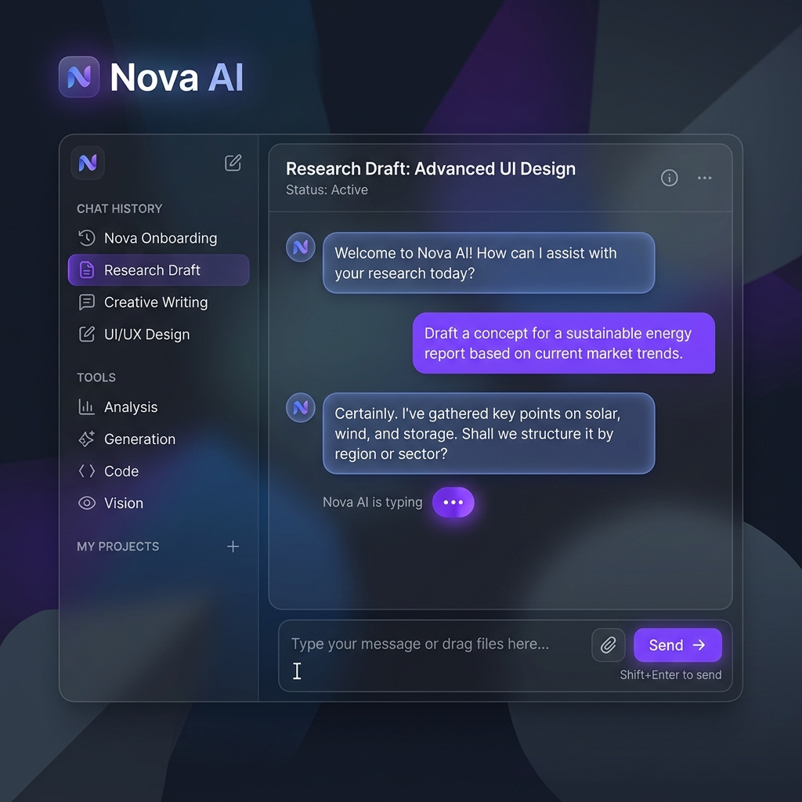
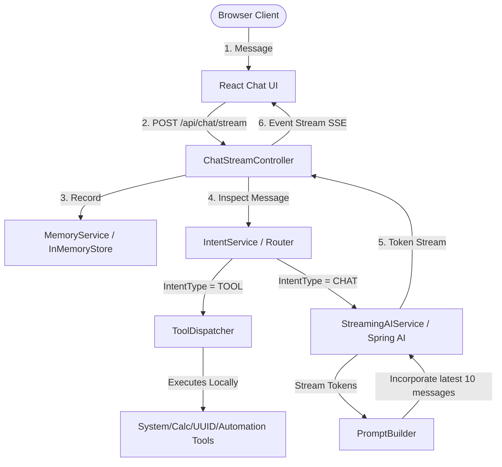

# Nova AI ⚡

Nova AI is a production-quality, step-by-step desktop assistant built using modern Spring Boot patterns, Clean Architecture principles, and a responsive React frontend.

It leverages intent routing to decide whether to execute desktop tools locally or stream requests to a Large Language Model (LLM).

---

## 🎨 Visual Mockup



---

## 🏗️ Architecture Design

The system is split into decoupled layers adhering to **SOLID** and Clean Architecture rules.

### Flow Diagram



---

## ⚡ Key Features

* **Server-Sent Events (SSE) Streaming:** Token-by-token stream rendering with typing indicators and cancellation support.
* **Smart Intent Router:** Analyzes user queries locally to bypass AI processing for simple tasks (time, system metrics, desktop launching, arithmetic).
* **Decoupled Tool Framework:** Dynamically registers local Java components as execution tools using Spring bean discovery.
* **Rolling Memory Windows:** Automatically trims in-memory conversation storage to keep only the latest 20 message pairs.
* **Desktop Automation:** Launches Windows applications (Google Chrome, Microsoft Edge, Notepad, Calculator, VS Code) using native `ProcessBuilder` commands.
* **Rich Markdown Renderers:** Visual rendering of markdown tables, lists, and syntax-highlighted code blocks in message bubbles.

---

## 💻 Tech Stack

* **Backend:** Java 21, Spring Boot 3.3.x, Spring AI (OpenAI API Model), Project Reactor
* **Frontend:** React, Vite, Tailwind CSS v4, Axios, Marked (Markdown compiler)
* **Build System:** Maven, npm

---

## 🚀 Installation & Setup

### Prerequisites
* JDK 21
* Node.js & npm
* Maven

### 1. Clone & Configure Backend
Create an environment variable containing your OpenAI API Key (or override it in `src/main/resources/application.properties`):
* **Linux/macOS:**
  ```bash
  export OPENAI_API_KEY="your_api_key_here"
  ```
* **Windows (PowerShell):**
  ```powershell
  $env:OPENAI_API_KEY="your_api_key_here"
  ```

Run the Spring Boot application on port `8081`:
```bash
mvn spring-boot:run
```

### 2. Configure & Run Frontend
Navigate to the `frontend/` directory and install client libraries:
```bash
cd frontend
npm install
```

Start the Vite development client on port `3000`:
```bash
npm run dev
```

Open [**http://localhost:3000**](http://localhost:3000) in your browser!

---

## 📖 API Documentation

### 1. Streaming Chat Endpoint
* **URL:** `POST /api/chat/stream`
* **Content-Type:** `application/json`
* **MIME Type (produces):** `text/event-stream`
* **Payload:**
  ```json
  {
    "message": "Explain Dependency Injection."
  }
  ```
* **Response format:** Streaming SSE data tokens.

---

### 2. Synchronous Chat Endpoint
* **URL:** `POST /api/chat`
* **Payload:**
  ```json
  {
    "message": "What is 2 + 2?"
  }
  ```
* **Response:**
  ```json
  {
    "reply": "4"
  }
  ```

---

### 3. Tool Management Endpoints
* **GET `/api/tools`**: Lists names and descriptions of all registered tools.
* **GET `/api/tools/{toolName}?input=...`**: Directly runs a specific tool locally.
* **POST `/api/tools/open`**: Body `{"application": "chrome"}` opens Chrome on Windows.

---

### 4. Memory Management Endpoints
* **GET `/api/memory`**: Lists the current rolling history containing `role` and `content`.
* **POST `/api/memory/clear`**: Clears dialogue logs.

---

## 🗺️ Project Roadmap

- [x] Initial Spring Boot Project Setup
- [x] Dynamic Java Tool Dispatcher
- [x] Keyword-based Intent Router
- [x] Desktop Automation Integration
- [x] Rolling In-Memory Memory Cache
- [x] Token-by-Token SSE Stream Renderer
- [x] Copy & Regeneration Controls
- [ ] Database Persistence (Migration from in-memory cache to PostgreSQL/H2)
- [ ] Retrieval-Augmented Generation (RAG) with local document indexes
- [ ] OS-Level mouse/keyboard macros using `java.awt.Robot`
